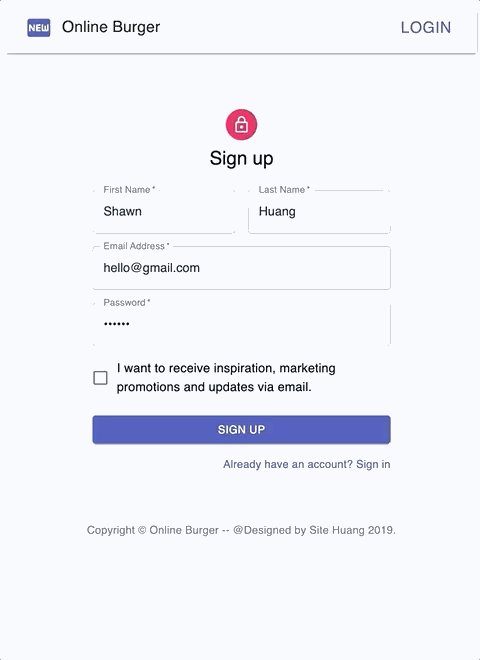

<p align="center">
  <a href="" rel="noopener">
 </a>
</p>

<h3 align="center">Online Burger Shop</h3>

<div align="center">

[]()
[](/LICENSE)

</div>

---

<p align="center"> 🍔 A simple online ordering website built with <b>React.js</b>, <b>Redux</b>, <b>Hooks</b>, and <b>Material-UI</b>.
    <br> 
</p>

## 📝 Table of Contents

- [About](#about)
- [Demo](#demo)
- [How it works](#working)
- [Getting Started](#getting_started)
- [Authors](#authors)

## 🧐 About <a name = "about"></a>

An online ordering website (Like Domino’s Pizza) with the functionalities including Login, Logout, Register, Select Items, Checkout, and Review orders.

## 🎥 Demo <a name = "demo"></a>

### Demo Website (Heroku): https://online-burger-shop.herokuapp.com/

### 💿 Register a New User
<br/>


### 📀 Make a New Order
<br/>


### 💽 Review My Orders
<br/>


## 💭 How it works <a name = "working"></a>

- Built the website as a Single-Page Application utilizing React.js, Redux, Hooks, and as well as Material-UI for CSS.
- Used Redux as the state management tool maintaining persistent state to avoid long props chain.
- Built a Node.js based server interacting with the MongoDB for storing data of users and orders.
- Implemented RESTful API server for transferring data and establishing the communication between web services and clients through HTTP protocol.
- Implemented the JWT token-based Authentication to verify the user identity.
- Advanced querying of MongoDB to filter and sort data.
- Improved the API Security of the server by integrating security modules such as preventing NoSQL Injection, encryption of password, API rate limiting, and XSS protection.


## 🏁 Getting Started <a name = "getting_started"></a>

These instructions will get you a copy of the project up and running on your local machine for development and testing purposes.

### 🔧 Prerequisites

What things you need to install the software and how to install them.

```
Node
React
MongoDB
```

### ⚙️  Setup [MongoDB](https://www.mongodb.com/)

Change the secret key of your own MongoDB
At **/server/config/config.env**

```
MONGO_URI={YOUR_MONGODB_CONNECT_KEY}
```

### ⛏️ Installing

At root folder
```
npm install
npm start
```

At **/server** folder
```
npm install
npm run dev
```

## ✍️ Authors <a name = "authors"></a>

- [@Shawn](https://github.com/SiteHuang) - Idea & Initial work
